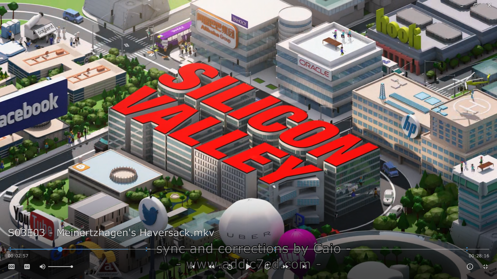

# 🌟 Hedaetul's Dotfiles

Welcome to my dotfiles repository! Here you'll find my personalized configuration files for various tools and applications that I use in my development environment.

---

## 🚀 Contents

- [MPV](#mpv)
- [Neovim](#neovim)
- [Fish Shell](#fish-shell)
- [Alacritty](#alacritty)
- [Alacritty Theme](#alacritty-theme)

---

## 🎥 MPV

[MPV](https://mpv.io) is a versatile media player that I customize for a streamlined viewing experience.



- **Location**: `mpv/`
- **Features**:
  - Custom key bindings
  - Enhanced video playback settings

---

## ✨ Neovim

[Neovim](https://neovim.io) is my go-to text editor, packed with plugins and settings to boost productivity.


- **Location**: `nvim/`
- **Features**:
  - Plugin management with `vim-plug`
  - Custom mappings and themes

---

## 🐚 Fish Shell

[Fish](https://fishshell.com) is a user-friendly command line shell that I configure to improve my terminal experience.


- **Location**: `fish/`
- **Features**:
  - Syntax highlighting
  - Custom functions and aliases

---

## 💻 Alacritty

[Alacritty](https://alacritty.org) is a fast terminal emulator with a beautiful interface.


- **Location**: `alacritty/`
- **Features**:
  - GPU-accelerated rendering
  - Customizable shortcuts

---

## 🎨 Alacritty Theme

My custom Alacritty theme, `hedaetul.toml`, enhances the terminal's visual appeal.


- **Location**: `alacritty/hedaetul.toml`

---

## 📦 Installation

To set up these configurations on your machine, clone this repository and create symlinks to the appropriate locations:

```bash
git clone https://github.com/hedaetul/dotfiles.git
cd dotfiles

# Example for setting up Neovim configuration
ln -s $(pwd)/nvim ~/.config/nvim
